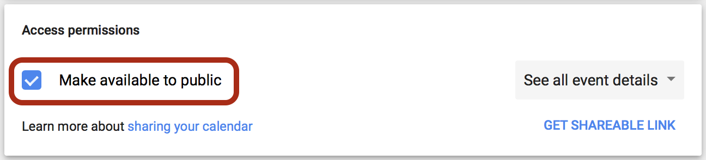
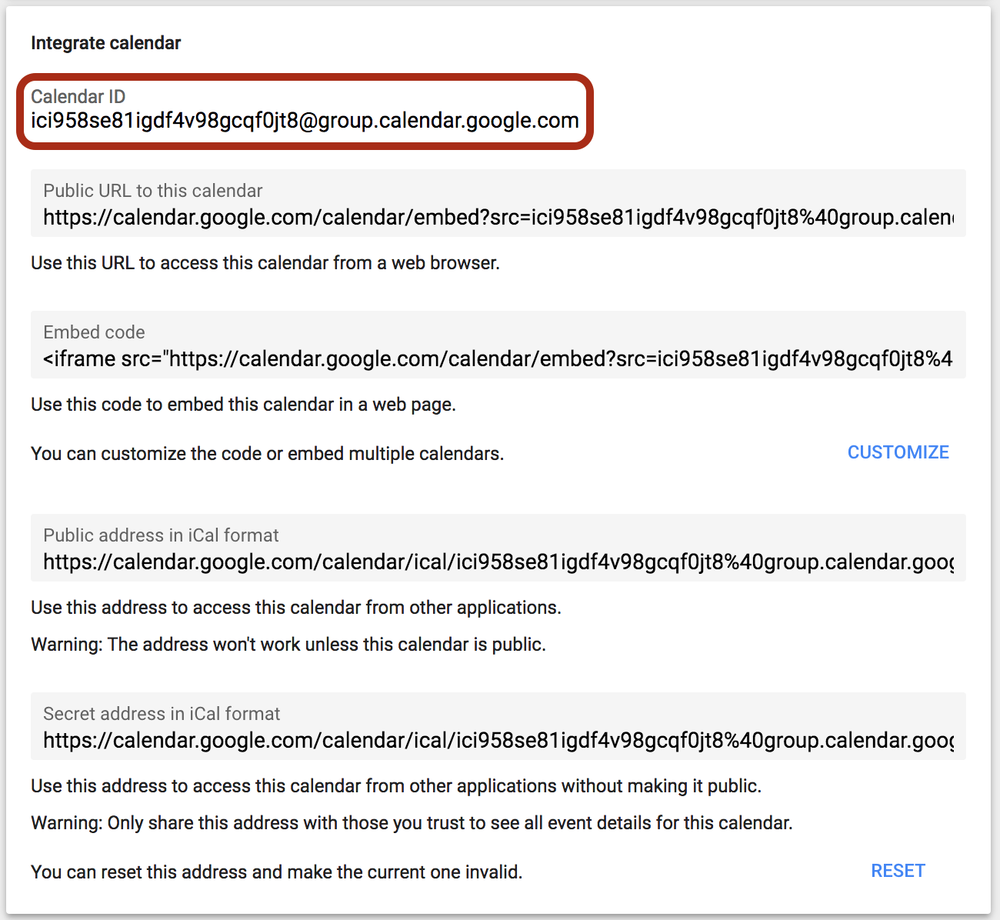

# Google Calendar

How to set up your Google Calendar.

## Access Permissions

Ensure your Calendar's access permissions are set to **public** by opening your calendar's settings and scrolling to the section titled **Access Permissions**.

Ensure the **Make available to public** is selected:

## Google Calendar ID

Find your calendar's Google ID by opening its settings and scrolling to the section titled **Integrate calendar**.

At the top of the section, you will find the calendar's ID.

This value should be stored in the `GOOGLE_CALENDAR_ID` environmental variable.

