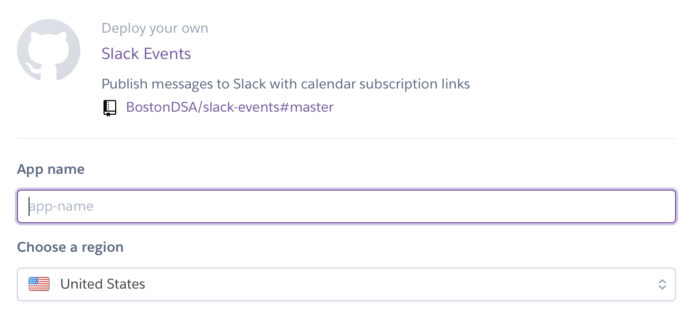
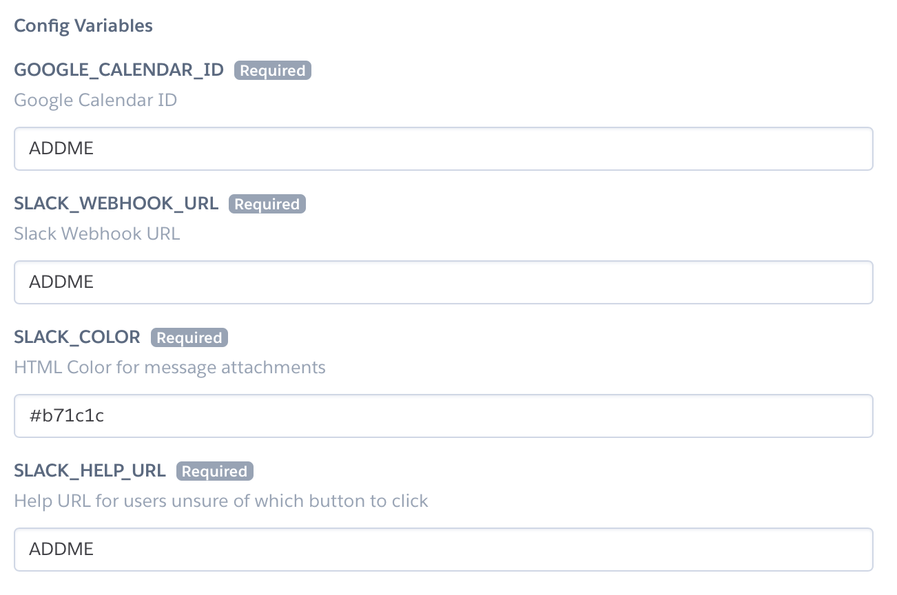
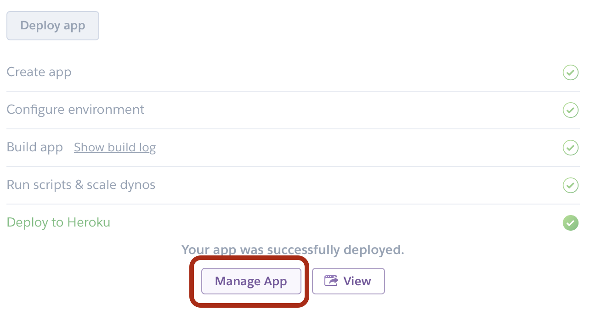
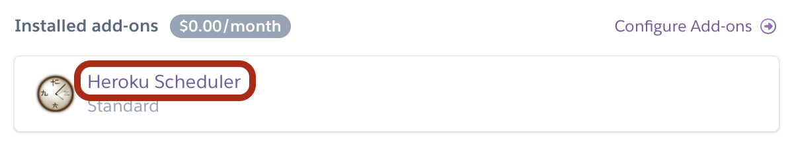
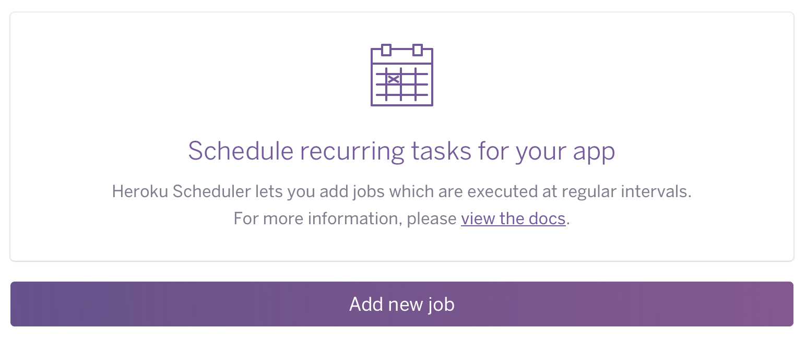
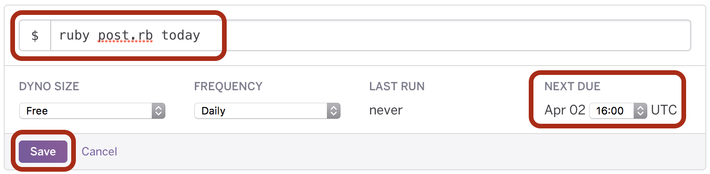

# Heroku

*Heroku is not required to use this application, but a deployment configuration is provided for your convenience. The job uses so few resources it will likely cost nothing to run indefinitely.*

Click the `Deploy to Heroku` button on this repo's [homepage](../README.md#deployment) to deploy a wireframe to Heroku.

## Setup

The first step is to give your app a name. This can be left blank to receive a random name, or filled in by you. The name of the app is not really important as it will not be referenced anywhere else. The only caveat is that it must be globally unique.

Next, fill in the ENV variables with values you procured in the [prerequisites](../README.md#prerequisites) section of the README.

Complete the deployment by clicking the `Deploy` button.

## Post Deploy

After the app has successfully deployed, click the `Manage App` button to add your scheduled job.

Find the add-ons section of your app, and click the `Heroku Scheduler` add on.

Add a new job:

Fill in the command with the text `ruby post.rb today`, choose a frequency for your app to post daily events to Slack, and then click the `Save` button.

*Keep in mind that the scheduler runs in UTC time, which does not observe daylight savings time and may be many hours ahead/behind your Slack users time zone.*

Congratulations! Your app will post daily summaries of your Google Calendar to Slack!
