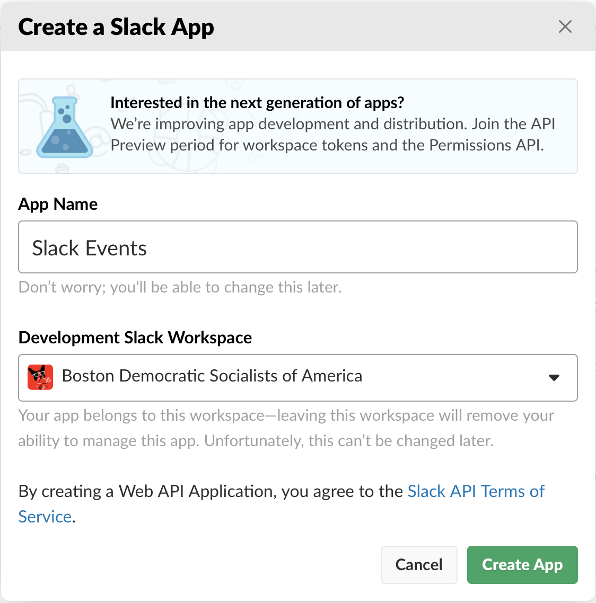
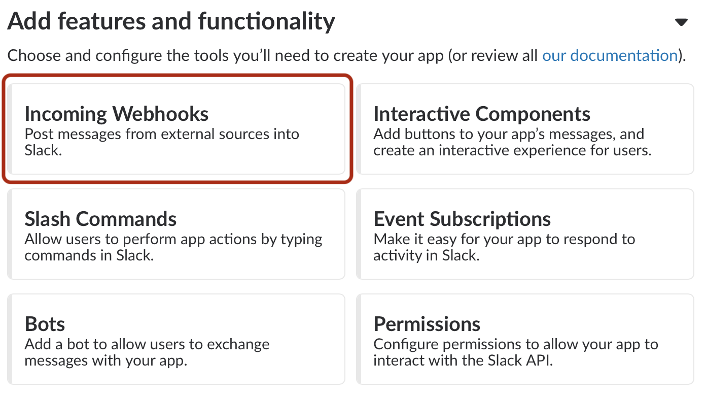
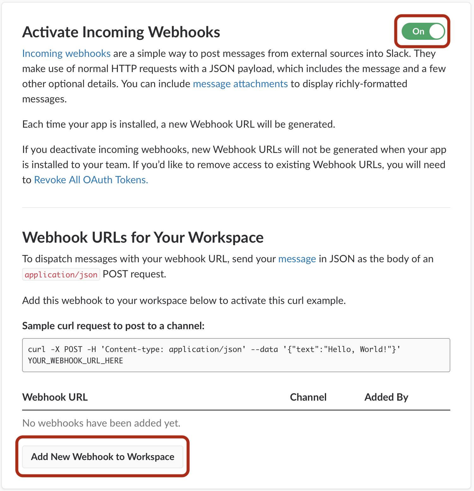
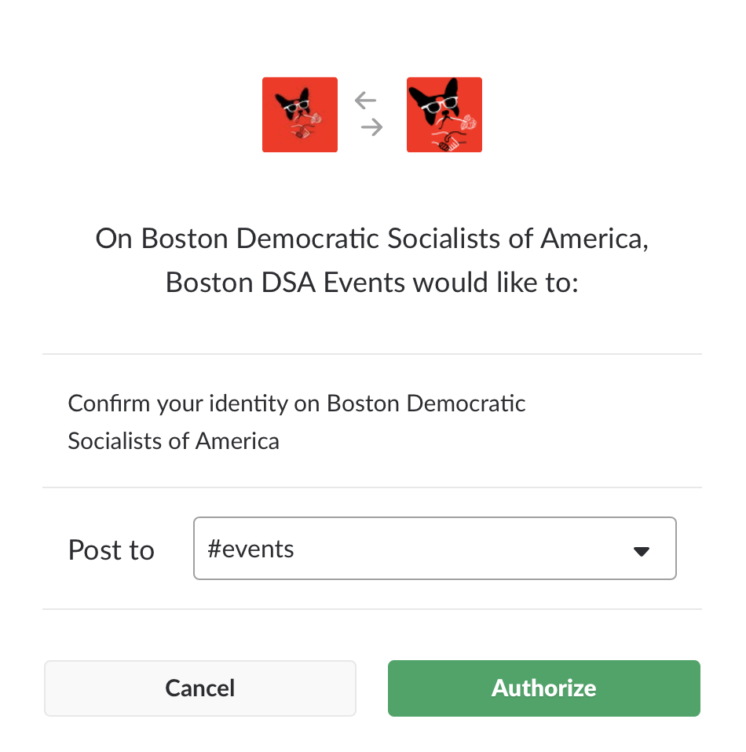
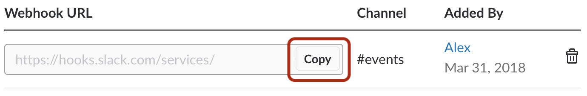

# Slack

How to set up your Slack App to receive messages from this application.

## Creating an App

*Skip this step if you've already created an app you wish to use.*

### Create a New App

Create a [new](https://api.slack.com/apps?new_app=1) Slack app. Give it a name and a workspace.

## Webhooks

After your app is created, you need to configure an *incoming webhook* to allow this app to send posts to your `#channel`.

### Add Feature

Under the *Add features and functionality* section of your new app, select **Incoming Webhooks**.

### Add Webhook

Ensure the switch at the top-right of the page is set to `On`, and click the button labeled **Add New Webhook to Workspace**.

### Grant Access

Grant your app access to post in a given `#channel`.

### Webhook URL

Once the webhook has been created, copy it with the **Copy** button.

This value should be stored in the `SLACK_WEBHOOK_URL` environmental variable.

